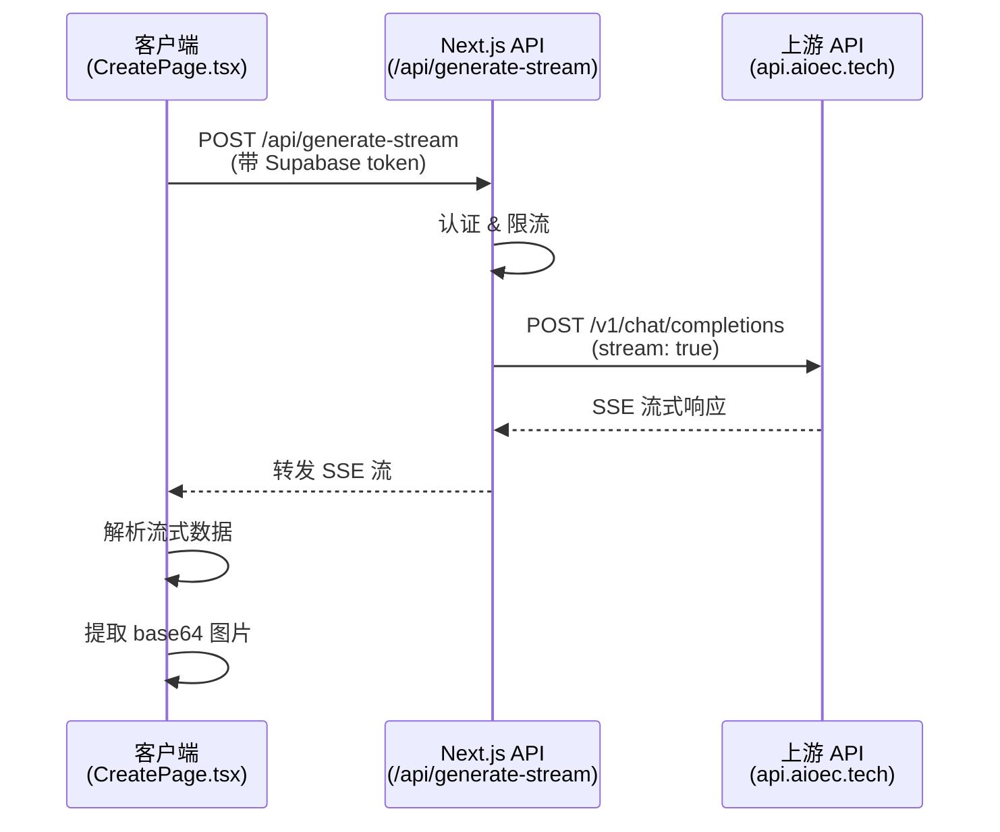

# 流式图片生成 API 实现说明

## 概述

本项目已实现基于流式 SSE（Server-Sent Events）的图片生成功能，参考了 `example/image-edit-demo.html` 的实现方式。

## 技术架构

### 1. 环境变量配置（`.env`）

```env
# 使用 chat 模式进行流式图片生成
IMAGE_API_MODE=chat

# API 配置
IMAGE_API_BASE_URL=https://api.aioec.tech
IMAGE_API_KEY=sk-13WThvEQGdYxRfwnnafAqDRgMtqKbBUH28RhFFITW3s7D6xw

# 模型配置
IMAGE_CHAT_MODEL=gemini-2.5-flash-image
```

### 2. 核心文件

#### 2.1 服务端 API 路由（`app/api/generate-stream/route.ts`）

- **功能**：接收客户端请求，转发到上游 AI API，返回流式响应
- **特性**：
  - 用户认证（Supabase）
  - 速率限制（每用户每分钟 5 次）
  - 隐藏 API Key（服务端处理）
  - 支持图片输入（最多 3 张）

#### 2.2 客户端封装（`lib/image-stream.ts`）

- **功能**：封装流式 API 调用逻辑
- **特性**：
  - SSE 流式解析
  - 跨 chunk 缓冲处理
  - 实时进度回调
  - 自动提取 base64 图片

#### 2.3 页面集成（`src/views/CreatePage.tsx`）

- **修改**：将原有的 `generateImage` 替换为 `generateImageStream`
- **特性**：
  - 实时显示生成进度
  - 流式状态更新
  - 错误处理与重试

## API 调用流程



## 请求格式

### 客户端调用

```typescript
import { generateImageStream } from '@/lib/image-stream';

const result = await generateImageStream({
  prompt: '生成一张婚纱照',
  imageInputs: [uploadedPhotos[0]], // 可选：参考图片
  n: 4, // 生成数量（目前 API 只返回 1 张）
  onProgress: (content) => {
    console.log('生成进度:', content.length);
  },
  onStatus: (status) => {
    console.log('状态:', status); // connecting | streaming | parsing | completed | error
  },
});

// 使用生成的图片
if (result.imageData) {
  const imageUrl = result.imageData.dataUrl; // data:image/png;base64,...
}
```

### API 请求体

```json
{
  "prompt": "生成一张婚纱照",
  "image_inputs": ["data:image/jpeg;base64,..."],
  "n": 4,
  "model": "gemini-2.5-flash-image"
}
```

### API 响应（SSE 流）

```
data: {"choices":[{"delta":{"content":"!"},"finish_reason":null}]}

data: {"choices":[{"delta":{"content":"[image"},"finish_reason":null}]}

data: {"choices":[{"delta":{"content":"](data:image/png;base64,iVBORw0..."},"finish_reason":null}]}

data: {"choices":[{"delta":{"content":""},"finish_reason":"stop"}]}

data: [DONE]
```

## 关键特性

### 1. SSE 流式解析

参考 `example/image-edit-demo.html` 的实现：

- 支持跨 chunk 的缓冲区处理
- 正确处理 SSE 事件边界（空行分隔）
- 兼容多行 `data:` 格式
- 健壮的 JSON 解析（容错处理）

### 2. 图片数据提取

```typescript
// 从 Markdown 格式中提取 base64 图片
const base64ImageMatch = content.match(
  /!\[image\]\(data:\s*image\/([^;]+);\s*base64,\s*\n?([^)]+)\)/i
);
```

### 3. 错误处理

- 认证失败：401 Unauthorized
- 速率限制：429 Too Many Requests
- 生成失败：自动记录到数据库，支持重试

## 与原有实现的区别

| 特性 | 原实现 (`generateImage`) | 新实现 (`generateImageStream`) |
|------|------------------------|-------------------------------|
| 调用方式 | `/api/generate-image` | `/api/generate-stream` |
| 响应类型 | JSON（一次性返回） | SSE（流式返回） |
| 实时进度 | ❌ | ✅ |
| 图片格式 | URL 或 base64 | base64（从 Markdown 提取） |
| 模型支持 | DALL-E、自定义 | gemini-2.5-flash-image |

## 注意事项

1. **API Key 安全**：
   - ✅ API Key 存储在服务端环境变量
   - ✅ 通过 Next.js API 路由调用
   - ❌ 不要在客户端直接调用上游 API

2. **速率限制**：
   - 当前配置：每用户每分钟 5 次
   - 可根据需求调整 `RL_LIMIT` 和 `RL_WINDOW_MS`

3. **图片数量**：
   - 目前上游 API 每次只返回 1 张图片
   - 如需多张，需要多次调用

4. **超时处理**：
   - 流式连接可能较长（1-2 分钟）
   - 前端需要适当的加载提示

## 测试建议

1. **功能测试**：
   - ✅ 上传图片 → 输入提示词 → 点击生成
   - ✅ 验证流式进度显示
   - ✅ 验证生成的图片可以正常显示

2. **错误测试**：
   - ✅ 未登录时的错误提示
   - ✅ 积分不足的处理
   - ✅ 网络异常的重试机制

3. **性能测试**：
   - ✅ 速率限制是否生效
   - ✅ 大图片上传的处理
   - ✅ 并发请求的处理

## 参考资料

- 原始实现：`example/image-edit-demo.html`
- API 文档：https://api.aioec.tech/v1/docs
- SSE 规范：https://html.spec.whatwg.org/multipage/server-sent-events.html


